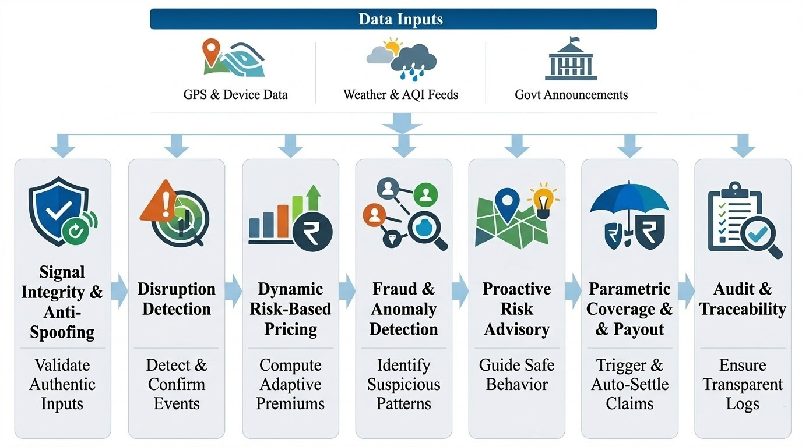
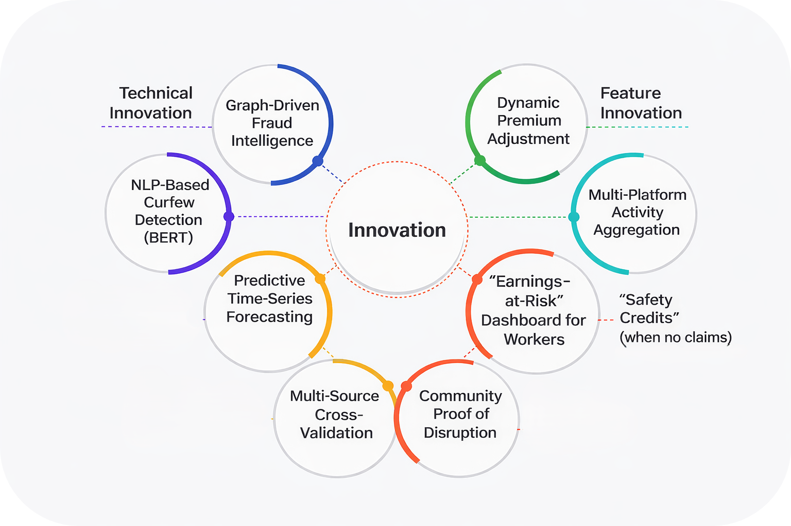

<h1></a></h1>

## **The Problem We’re Solving**

>Platform-based delivery partners in India experience significant and recurring income loss due to external disruptions such as extreme weather, high pollution levels, and natural disasters, which directly reduce their working hours and earning opportunities. Despite being critical to the digital economy, they lack any formal income protection or insurance mechanisms, leaving them financially vulnerable and solely responsible for losses caused by factors beyond their control.

## **Solution Overview**

> We are building a **mobile-first platform** that enables enrollment, coverage management, real-time monitoring, and automated payouts through a unified interface.
>
> The system operates on a **weekly subscription model**, where coverage is dynamically priced based on real-time risk signals.
>
> The application collects and processes key inputs such as **geolocation, device metadata, and activity patterns**, and integrates external data sources including weather APIs, AQI feeds, and official government announcements.
>
> To ensure data integrity, the platform incorporates a **dedicated signal integrity layer with controlled access to location and device-level signals during active sessions**, reducing the risk of manipulation, and synthetic activity.
>
> From a functional standpoint, the platform provides:
>
> - Coverage activation and subscription management
> - Real-time risk and disruption monitoring
> - Proactive risk insights and worker guidance
> - Automatic event detection and validation
> - Instant payout execution without manual claims
>
> This application layer interfaces with backend systems responsible for **signal validation, risk modeling, event verification, fraud detection, advisory intelligence, and payout automation**.

## **System Flow**

>| # | Component | Description | Location |
>| :-- | :--- | :--- | :--- |
>| 1 | **Solution Architecture** | Detailed breakdown of all components and their roles within the overall system design. | [`docs/Solution_architecture.md`](./docs/Solution_architecture.md) |

  

> The platform operates through a structured pipeline in which **real-time disruption signals are detected, validated, and transformed into actionable insurance events**.
>
> It begins by collecting **device and external signals**, which are validated through a **signal integrity layer** to ensure authenticity. Verified inputs are processed by **AI models** to detect and confirm disruption events such as weather anomalies, pollution spikes, or curfews.
>
> These signals feed into a **dynamic risk engine** for pricing, while a **graph-based fraud layer** identifies suspicious behavior. The system also provides **proactive guidance** to help workers avoid high-risk situations.
>
> When a valid event is detected, **parametric payouts are triggered automatically**, with all actions recorded in an **audit layer** for transparency.

## **Pricing Model Overview** 

>The system utilizes a **Weekly Predictive Underwriting** approach. Unlike traditional insurance models relying on static historical averages, our system calculates premiums based on **Real-Time Risk Probability (RRP)** and **Individualized Earnings Potential (IEP)** for the upcoming seven-day window.
>
>The objective is to neutralize the financial impact of external disruptions (Environmental, Regulatory, or Macro-economic) through hyper-localized pricing.
>
>>## *Formula*
>>
>>$$P_w = \left( \frac{(L_e \cdot V_s) \cdot \Phi_r}{K} \right) \cdot (1 + M)$$
>>
>>**Variables:**
>>- $P_w$: Weekly Premium
>>- $L_e$: Expected Income Loss (Base)
>>- $V_s$: Spatio-Temporal Volatility Score (Local risk variance)
>>- $\Phi_r$: Worker Reliability Multiplier (Historical engagement index)
>>- $K$: Risk Pool Normalization Factor (converts individual risk into pooled, affordable pricing)
>>- $M$: Operational Margin (22% – 34%)
>>---
>| # | Component | Description | Location |
>| :-- | :--- | :--- | :--- |
>| 2 | **Pricing Model** | Explains how weekly premiums are calculated using predicted income loss, risk factors, and AI-driven adjustments.| [`docs/Pricing_Model.md`](./docs/Pricing_Model.md) |

## **Adversarial Defense & Anti-Spoofing Strategy Overview**

>The system is already well designed to defend against **coordinated “Market Crash” attacks**, where large fraud rings simulate disruption events to drain parametric insurance pools.
>
>At its core is a **graph-based detection layer (R-GCN)**, which performs the majority of fraud identification by analyzing **relationships between workers, devices, networks, and payout channels**. This enables detection of **synthetic clusters (fraud rings)** even when individual signals appear legitimate.
>
>To further improve robustness and handle edge cases, two additional defense layers are introduced:
>
>- **Layer 1 (Device & Signal Integrity):** Validates that inputs originate from authentic hardware and consistent physical behavior.
>- **Layer 3 (Temporal Coordination Analysis):** Identifies synchronized activity patterns indicative of automated, large-scale attacks.
>
>This **three-layer architecture** ensures that:
>
>>- Spoofed or tampered signals are filtered at the **device level** 
>>- Fraud is detected **structurally** through graph relationships, and
>>- Coordinated attacks are exposed via **temporal anomalies**.
>
>By combining these independent validation layers, the system achieves **strong adversarial resilience**.
>| # | Component | Description | Location |
>| :-- | :--- | :--- | :--- |
>| 3 | **Market Crash Defense** | Detailed Explantion of three-layer fraud defense strategy combining device integrity, graph-based ring detection (R-GCN), and temporal analysis to mitigate coordinated spoofing attacks. | [`docs/Market_Crash_Defense.md`](./docs/Market_Crash_Defense.md) |
>| 4 | **Literature Review** | Analysis of anti-spoofing research and prior work, whose insights are adapted using transfer learning to strengthen the system’s fraud detection capabilities. | [`docs/Literature_Review.md`](./docs/Literature_Review.md) |

## **Innovation** 

  

>| # | Component | Description | Location |
>| :-- | :--- | :--- | :--- |
>| 5 | **Innovation** | Highlighting our key innovations across both technical architecture and product features. | [`docs/Innovation.md`](./docs/Innovation.md) |

## **Planned Tech Stack**

>### AI / Machine Learning
>>| Technology | Category | Role in System |
>>| :--- | :--- | :--- |
>>| **DeepAR / TFT** | Forecasting | weekly disruption probability forecasting |
>>| **XGBoost** | ML Model | MVP Model |
>>| **R-GCN** | Fraud Detection | Core graph-based fraud ring detection |
>>| **T-GNN** | Fraud Detection | Detects synchronized or scripted payout attacks via temporal coordination analysis |
>>| **BERT** | Signal Processing | Parses local news and government announcements for curfew or disruption signals |
>
>---
>
>### Application Platform
>>| Technology | Category | Role in System |
>>| :--- | :--- | :--- |
>>| **Flutter** | Mobile Application | Enrollment, coverage management, monitoring, and payout interface |
>>| **Python** | Backend | Acts as a bridge, receiving requests from the Flutter app and querying the database |
>>| **SHA-256** | Hashing | Immutable log of all signal validations, event detections, and payout executions |
>>| **JWTs** | Security | Controlled session-level access to location and device signals to prevent manipulation |
>
>---
>
>### Data Infrastructure and Engineering 
>>| Technology | Category | Role in System |
>>| :--- | :--- | :--- |
>>| **PostgreSQL** | DB | Store information and sync it across devices |
>>| **PostGIS** | Geospatial DB | Stores and queries spatial risk zone data |
>>| **H3 Index** | Spatial Indexing | Hexagonal binning of risk zones for hyper-local pricing using grid system |
>>| **Feast** | Feature Store | Real-time serving of historical earnings features for the pricing engine |
>>| **Prefect / Airflow** | Orchestration | Schedules weather and AQI data ingestion pipelines |
>>| **BentoML** | Inference Engine | Serves XGBoost and TFT models in production |
>
>---
>
>### External Data Sources
>>| Technology | Category | Role in System |
>>| :--- | :--- | :--- |
>>| **IMD Satellite Data** | Weather API | Primary weather feed for the disruption probability model |
>>| **CPCB Sensor Grids** | AQI Feed | Air quality index data for pollution-based disruption detection |
>>| **Government Announcements** | Regulatory Feed | Automatically detects curfews, lockdowns, and public safety events |

---

## **The Prototype**

>The interactive simulation at [devtrailers-prototype.onrender.com](https://devtrailers-prototype.onrender.com) was built deliberately lightweight so it runs anywhere, on any device. It's a proof-of-concept demonstrator, not the production engine, but it makes the system's logic visible and testable.

## **Challenges we ran into**

>- **Fraud at scale is subtle.** The hardest part of designing the R-GCN layer wasn't the model itself — it was accepting that individual fraudulent signals can look *completely legitimate*. A single GPS ping from a spoofed device is indistinguishable from a real one. Only the relational structure — five devices with identical sensor noise all pinging from the same 50-metre radius — gives the game away. That realization fundamentally changed how we thought about the fraud architecture.
>
>- **Where exactly is the parametric trigger?** Deciding *when* a weather event is severe enough to constitute a valid disruption was genuinely hard. Too sensitive and workers game it; too strict and you're not protecting the people who actually need it. Calibrating that threshold — and making it audit-transparent — took a lot of back and forth.
>
>- **Making the pricing fair, not just sound.** The actuarial math is one thing. Making it *affordable* for someone earning ₹600 a day is another. The Spatio-Temporal Volatility Score ($V_s$) in particular needed to reflect *hyper-local* risk — not just "Delhi is risky in November" but "Zone 4B of South Delhi is riskier than Zone 4A on Tuesday afternoons." That level of granularity is easy to specify and genuinely hard to compute.
>
>- **Signal integrity without surveillance.** We needed enough behavioral and device-level signals to detect spoofing. But we were acutely aware that asking a low-income delivery worker to consent to deep device monitoring is ethically fraught. The system had to be lightweight, transparent, and constrained to active sessions only.

## **Accomplishments that we're proud of**

>- Designed a **complete, end-to-end system architecture** — from raw signal ingestion to automated payout — with every component specified, justified, and documented
>- Derived a **mathematically grounded weekly pricing formula** with real actuarial logic, built specifically for the Indian gig context rather than adapted from a Western model
>- Built and deployed a **working interactive simulation** that makes the entire system's behavior tangible and testable in a browser — parametric triggers, fraud attacks, and all
>- Developed a **three-layer adversarial defense architecture** backed by a formal literature review of over 10 research papers on GPS spoofing, graph-based fraud detection, and anti-spoofing transfer learning — synthesizing insights from academic work into a practical, deployable design
>- Framed a solution that is genuinely **accessible** — no prior insurance history, no paperwork, no smartphone required beyond a basic Android device

## **What we learned**

>- **Parametric insurance is uniquely powerful for vulnerable populations.** Removing the claims process isn't just a UX improvement — it eliminates the exact barrier that has kept informal workers out of insurance for decades.
>
>- **Graph-based ML is essential for fraud in connected systems.** We came in thinking anomaly detection on individual records would be sufficient. We left convinced that without the relational layer, any parametric pool is wide open to coordinated attacks.
>
>- **Pricing for informal workers means unlearning actuarial defaults.** Classical models assume salaried income, formal claim history, and documented records. None of those exist here. Building from scratch was uncomfortable and necessary.
>
>- **System design is as important as the models.** The audit layer, the session-controlled signal access, the three-layer independence of the fraud stack — these architectural decisions matter as much as the AI components for real-world trust and accountability.
>
>- **Research papers are only useful if you translate them.** We read through more than 10 papers on anti-spoofing, graph fraud detection, and parametric insurance design. 
>
>- The real work wasn't technical instead it was forming ideation after figuring out what each finding *actually meant* for a gig worker in Chennai with a ₹8,000/month income.

## **What's next for Devtrailers**

We're at the end of ideation and the start of something real. Here's where we want to go:

>- **Build the actual engine** — move from architecture diagrams and a simulation prototype to a working backend: the signal validation layer, the pricing engine, and the fraud detection stack
>- **Pilot with a real delivery fleet** — onboard 50–100 delivery workers in Bengaluru or Chennai to validate the pricing model and payout triggers with real behavioral data
>- **Live API integration** — connect to India Meteorological Department (IMD) and CPCB feeds for genuine real-time disruption triggers instead of simulated ones
>- **UPI AutoPay** — wire up the UPI stack for frictionless weekly premium collection and instant payout disbursement
>- **Expand disruption categories** — platform outages, fuel price spikes, state-level bandhs, emergency orders
>- **Multilingual Android app** — Hindi, Tamil, Telugu, Kannada — built for last-mile accessibility, not just for smartphones with great specs
>- **Open the risk pool** — let NGOs, worker unions, or platform companies co-sponsor coverage and contribute to $K$, pushing premiums down for the workers who need it most

## **Resource Mapping**

| # | Component | Description | Location |
| :-- | :--- | :--- | :--- |
| 1 | **Solution Architecture** | Detailed breakdown of all components and their roles within the overall system design. | [`docs/Solution_architecture.md`](./docs/Solution_architecture.md) |
| 2 | **Pricing Model** | Explains how weekly premiums are calculated using predicted income loss, risk factors, and AI-driven adjustments.| [`docs/Pricing_Model.md`](./docs/Pricing_Model.md) |
| 3 | **Market Crash Defense** | Detailed Explantion of three-layer fraud defense strategy combining device integrity, graph-based ring detection (R-GCN), and temporal analysis to mitigate coordinated spoofing attacks. | [`docs/Market_Crash_Defense.md`](./docs/Market_Crash_Defense.md) |
| 4 | **Literature Review** | Analysis of anti-spoofing research and prior work, whose insights are adapted using transfer learning to strengthen the system’s fraud detection capabilities. | [`docs/Literature_Review.md`](./docs/Literature_Review.md) |
| 5 | **Innovation** | Highlighting our key innovations across both technical architecture and product features. | [`docs/Innovation.md`](./docs/Innovation.md) |
| 6 | **Presentation Video** | A presentation video demonstrating our solution and its functionality. | [`assets/presentation_video.mov`](./presentation_video.mov) |
| 7 | **Prototype Demo** | A Demo Video to simulate the basic working prototype | [`assets/prototype_video.mov`](./prototype_video.mov) |

---